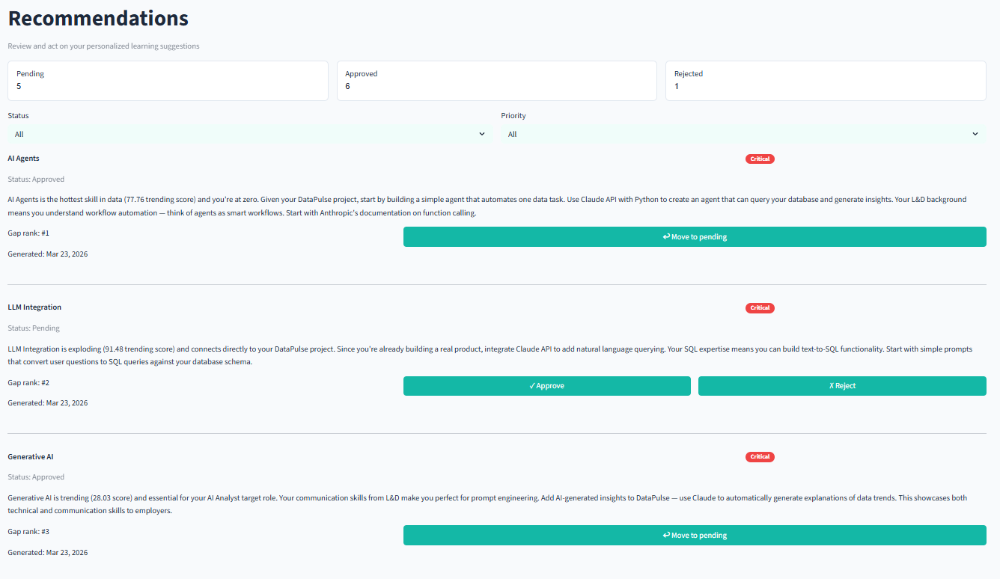

# DataPulse

Personal AI career intelligence platform for data analysts and engineers.

DataPulse profiles your skills, monitors the global data/AI ecosystem, compares market demand against your profile, identifies skill gaps, and generates personalized learning recommendations — fully automated, every two weeks.

🚀 **Live app:** [datapulse-jzzz4zerfhvdkhxmbyopzd.streamlit.app](https://datapulse-jzzz4zerfhvdkhxmbyopzd.streamlit.app)

> Built with production-grade architecture — Supabase Auth, Row Level Security on every table, user-scoped queries throughout. Additional users can be added to the database. Not public due to API costs, but the infrastructure supports it.

---

## Status

🟢 **All 5 modules shipped.** Fully automated biweekly pipeline running in production.

See [STATUS.md](docs/STATUS.md) for current state.

---

## How it works

```
Every other Sunday (UTC), automatically:

RSS feeds (31 sources) → Claude Haiku signal extraction → dbt models (11 models, 30+ tests)
→ skill gap analysis (normalized 0–10) → Claude Sonnet recommendations → markdown report

Your effort: read the report, approve or reject suggestions. ~5 minutes per cycle.
```

---

## Key numbers

| Metric | Value |
|--------|-------|
| RSS feeds monitored | 31 (7 categories) |
| Articles ingested per run | ~1,715 |
| Market signals extracted | 940+ |
| Extraction cost | ~$0.30 per full run |
| dbt models | 6 staging · 3 intermediate · 2 mart |
| dbt schema tests | 30+ |
| Supabase tables | 14+ (RLS on every table) |
| Build time | ~3 months · 3–4 hours/week |

---

## Tech stack

Supabase (PostgreSQL + Auth + RLS) · dbt Core · Python · Claude API · GitHub Actions · Cursor · Streamlit

---

## Modules

| # | Module | What it does |
|---|--------|--------------|
| 1 | **Profile Engine** | Onboarding questionnaire + Claude CV parsing → complete skill profile in Supabase |
| 2 | **Market Intelligence Agent** | 31 RSS feeds → Claude Haiku batch extraction → market signals stored in Supabase |
| 3 | **Skill Gap Analyzer + Reports** | dbt joins signals with user skills → gap scores → Claude Sonnet recommendations → markdown report auto-committed to GitHub |
| 4 | **Learning Path Updater** | Approved recommendations update curriculum priorities · auto-commit pipeline · Mermaid architecture diagram |
| 5 | **Multi-User App + Learning Lab** | Streamlit frontend · Supabase Auth · integrated Learning Lab with Claude-powered answer evaluation · assessment results auto-update skill profile |

---

## Screenshots

### Recommendations


### Learning Lab — Question


### Learning Lab — Correct feedback


### Learning Lab — Wrong feedback


### Biweekly report


---

## Architecture principles

- **Multi-user from day 1** — every table has `user_id`, every query is RLS-scoped, auth is Supabase Auth
- **Cost-conscious AI** — Claude Haiku for extraction (~$0.30/run), Sonnet reserved for personalization; same content never analyzed twice
- **Automation over manual** — zero human steps from cron trigger to committed report
- **Complexity is the enemy** — no LangChain, no FastAPI, no Airflow; every tool earns its place
- **Portfolio-grade code** — every architectural decision logged in [DECISIONS.md](docs/DECISIONS.md) with date and rationale

---

## Documentation

- [Product Brief](docs/PRODUCT_BRIEF.md) — what this is and why
- [Decision Log](docs/DECISIONS.md) — every architectural decision with reasoning
- [Current Status](docs/STATUS.md) — where the project is right now

---

## Author

Built by [Romi](https://github.com/romcamaky) as part of the [From Analyst to AI-Native Engineer](https://github.com/romcamaky/AI-Native-Data-Engineer-Journey) journey.

## License

MIT
