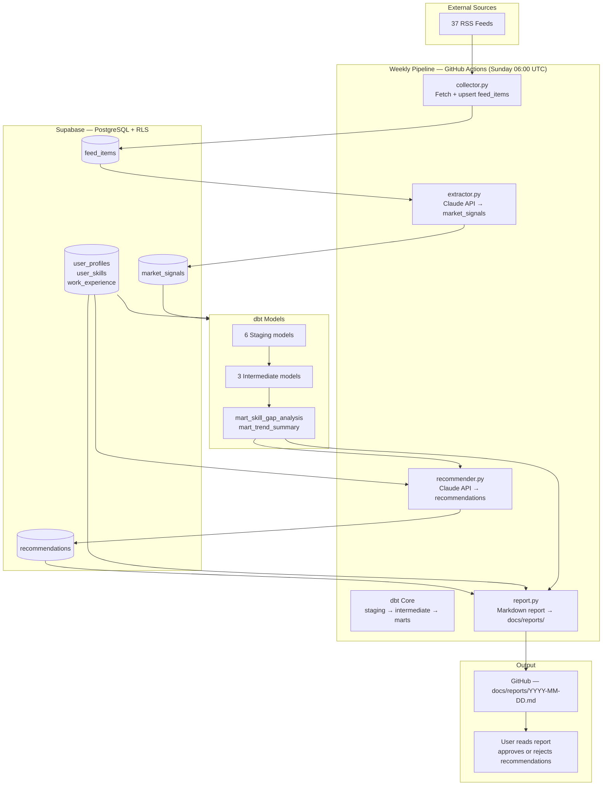

---

# DataPulse — System Overview

DataPulse is a personal AI career intelligence platform for data analysts and engineers: it ingests public market signals from RSS, combines them with your profile and skills in Supabase, and uses dbt plus Claude to surface skill gaps, learning recommendations, and a readable weekly markdown report. It is built as a portfolio-grade, multi-tenant-ready pipeline (RLS, clear module boundaries) with minimal moving parts—plain Python, dbt Core, and GitHub Actions—so you can explain and own every layer.

---

## Architecture

A Mermaid flowchart (top-down) showing the full data flow.

---

## Modules

### Module 1 — Profile Engine

- What it does: Captures your career context, skills, work history, and target roles through an interactive CLI questionnaire and writes everything to Supabase in one batch. A skills mapper resolves free-text skill names to the canonical `skills` taxonomy so downstream joins stay consistent.
- Key files: `src/datapulse/onboarding.py`, `src/datapulse/skills_mapper.py`
- Schema: `user_profiles`, `user_skills`, `work_experience`, `user_target_roles`, `skills`
- Status: ✅ Complete

### Module 2 — Market Intelligence Agent

- What it does: On a schedule, fetches many RSS sources defined in code, deduplicates and stores articles in `feed_items`, then runs a batch extractor that calls Claude to produce structured `market_signals` linked to the skills dimension where possible.
- Key files: `src/datapulse/collector.py`, `src/datapulse/extractor.py`, `src/datapulse/feeds_config.py`
- Schema: `feed_items`, `market_signals`
- Automation: `market_intelligence.yml` — Sunday 06:00 UTC, biweekly (even ISO weeks only on schedule; manual runs always execute)
- Status: ✅ Complete

### Module 3 — Skill Gap Analyzer + Report Generator

- What it does: dbt joins global signals to user skills to produce gap and trend marts; the recommender loads those marts plus profile context, calls Claude Sonnet once per user, and writes rows to `recommendations`. The report generator reads profile, gaps, trends, and pending recommendations and emits a dated markdown file under `docs/reports/`.
- Key files: `src/datapulse/recommender.py`, `src/datapulse/report.py`
- dbt models: 6 staging → 3 intermediate → 2 marts
- Schema: `recommendations`
- Status: ✅ Complete

### Module 4 — Learning Path Updater + Testing

- What it does: Focus for this phase includes wiring operational concerns around the weekly loop: the GitHub Actions workflow already generates the markdown report and auto-commits `docs/reports/` to the repo (`Commit report to repository`), while a `dbt run` step remains a placeholder until Module 4 monitoring; broader “learning path updater” behavior and automated testing are still in progress.
- Status: 🟡 In progress

### Module 5 — Multi-User App (Capstone)

- One sentence placeholder: A future web app on Supabase Auth with onboarding, dashboard, and in-app report/recommendation workflows for multiple users.
- Status: ⬜ Not started

---

## Tech Stack

| Layer | Tool | Purpose |
|-------|------|---------|
| Database & Auth | Supabase (PostgreSQL + RLS) | Storage, auth, row-level security |
| Transformations | dbt Core | 3-layer modeling: staging → intermediate → marts |
| Pipeline | Python | Ingestion, Claude API integration, report generation |
| Intelligence | Claude API (Anthropic) | Trend extraction, skill gap recommendations |
| Automation | GitHub Actions | Weekly cron, CI/CD, report auto-commit |
| Version Control | GitHub | Public portfolio repo |

---

## Data Flow — Weekly Cycle

1. **Trigger** — The workflow `.github/workflows/market_intelligence.yml` runs on a cron schedule (**Sunday 06:00 UTC**) or via **`workflow_dispatch`** (manual run from the Actions tab).
2. **Biweekly gate** — On **scheduled** runs only, a shell step checks the **ISO week number**: if it is **odd**, the rest of the job is skipped (biweekly cost control). **Manual** runs always continue.
3. **Repository setup** — Checkout (`actions/checkout@v4` with persisted credentials), **Python 3.12**, and **`pip install -e .`** install the `datapulse` package.
4. **RSS ingestion** — **`python -m datapulse.collector`** (`collector.py`) fetches configured feeds and upserts rows into **`feed_items`** (failures in this step do not fail the job).
5. **Signal extraction** — **`python -m datapulse.extractor`** (`extractor.py`) reads unprocessed items and writes **`market_signals`** via the Claude API.
6. **dbt models** — **dbt Core** should refresh **staging → intermediate → marts** so `mart_skill_gap_analysis` and `mart_trend_summary` stay current. In CI today the **“Run dbt models”** step is a **placeholder** (comment only); run **`dbt run`** locally or add it to the workflow when ready.
7. **Recommendations** — **`python -m datapulse.recommender`** (`recommender.py`) generates personalized rows in **`recommendations`** from marts and profile data. It is **not** part of the GitHub Actions workflow yet; run it via CLI when you need fresh recommendations before the report.
8. **Report** — **`python -m datapulse.report`** (`report.py`) queries Supabase and writes **`docs/reports/YYYY-MM-DD.md`** (UTC date).
9. **Publish** — The **“Commit report to repository”** step stages **`docs/reports/`**, commits if there are changes, and **`git push`**es to GitHub (using the Actions token), so the report is visible in the repo for review.

---

## Key Design Decisions

- **Multi-user from day 1** — RLS and `user_id` on user-scoped tables so the same schema can serve a future multi-tenant app without a rewrite.
- **Junction table over array columns** — `work_experience_skills` (junction) instead of UUID arrays on `work_experience` for clean joins, FK integrity, and clearer modeling.
- **No LangChain / CrewAI / Airflow** — Plain Python plus the Claude API keeps the pipeline small, cheap, and explainable (see tech stack exclusions in the decision log).
- **Hierarchical skills taxonomy** — Canonical `skills` with `parent_skill_id` (self-referencing FK) so market signals and user skills normalize to one vocabulary.
- **Service role for pipeline writes** — Batch jobs use the Supabase **service role** key to bypass RLS for trusted writes (e.g. `market_signals`, `recommendations`); authenticated clients use RLS-scoped reads/updates as designed.
- **Biweekly pipeline gate** — RSS + extraction (and thus much of the scheduled job) runs only on **even ISO weeks** to control API cost while keeping a weekly cron slot.

---
